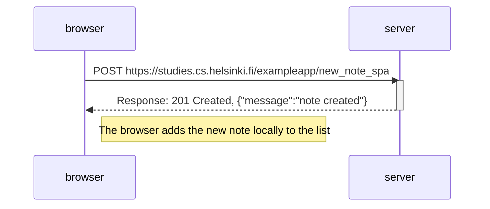

```mermaid
  sequenceDiagram
    participant browser
    participant server

    browser->>server: POST https://studies.cs.helsinki.fi/exampleapp/new_note_spa
        activate server
        server-->>browser: Response: 201 Created, {"message":"note created"}
        deactivate server
Note right of browser: The browser adds the new note locally to the list
```
